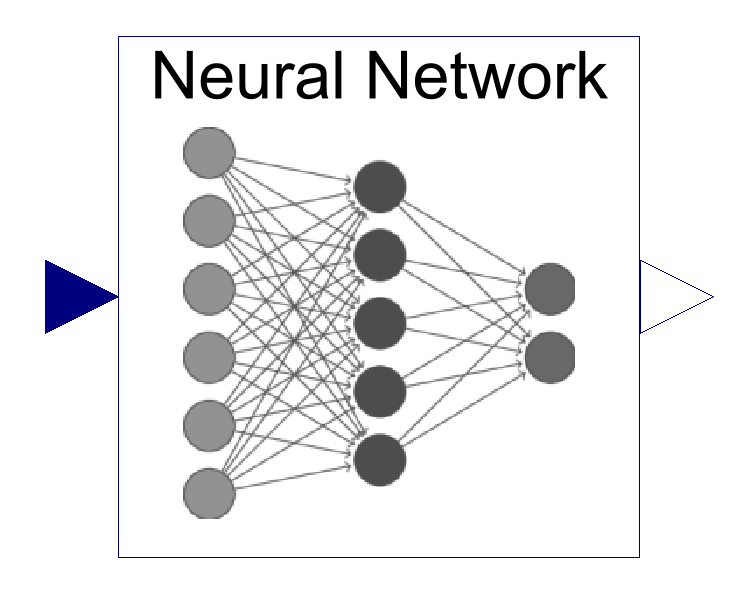
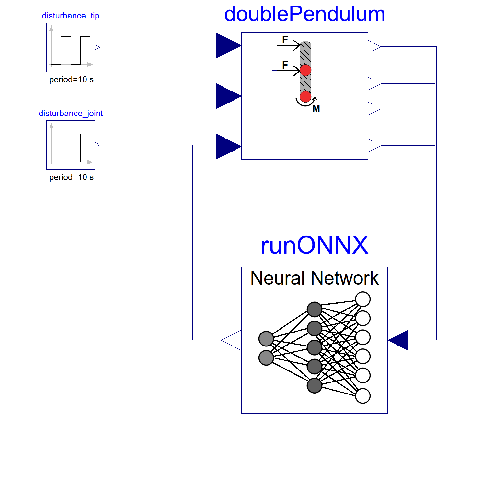
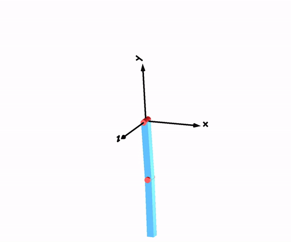
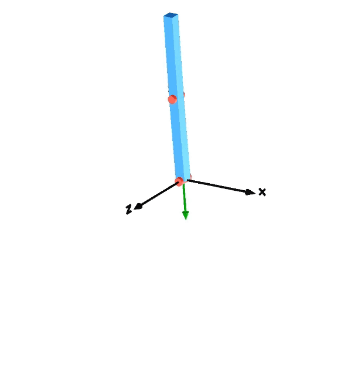
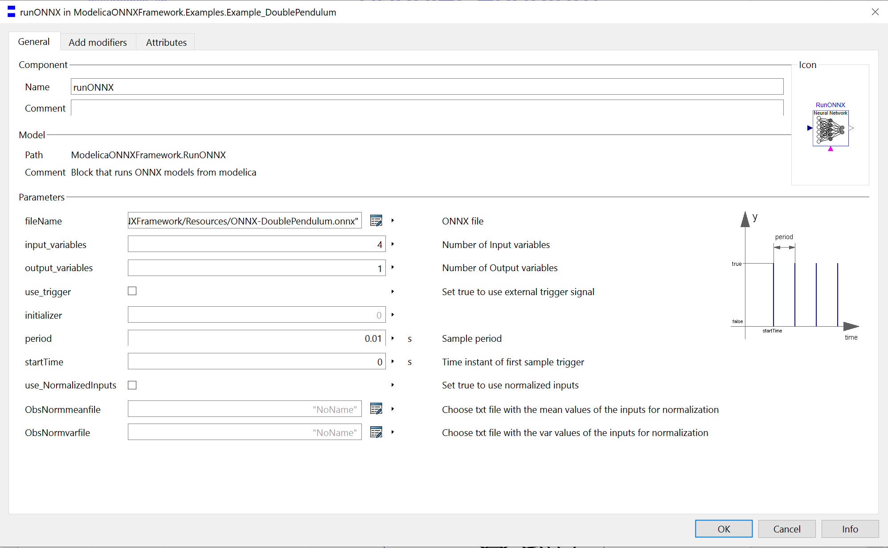

# MoONNX

---

Integrate machine learning models **directly into your Modelica models** with **MoONNX**.

---

 

    

    <b>Fig 1: RunONNX block to implemented neural networks in Modelica</b>

 
 

## Features of MoONNX
MoONNX empowers you to run  pre trained machine learning models directly integrated in your Modelica
modeling and simulation environment. This is achieved by utilizing external C functions which utilize the ONNX Runtime [library](https://github.com/microsoft/onnxruntime).
As shown in the example, can neural networks easily be added by drag and drop the block "RunONNX" from the library.

 

    
    

    <b>Fig 2/3: Double pendulum model controlled with a neural network</b>

 
 

## Areas of application
**Test neural networks in various simulation scenarios**  
Utilize all the modeling and simulation tools available to observe how your neural networks respond to different scenarios.

    
    

    <b>Fig 4/5: Test of a double pendulum model controlled with a neural network</b>

 
 

**Integrate surrogate models for faster simulations**  
Replace detailed system models with machine learning-based surrogate models to speed up simulations.

**ToDo:**
add example

 
 

## Getting Started
Follow these steps to use MoONNX in your projects:

1. Download the repository, then copy the folder "MoONNX" to your Dymola libraries.
2. Save your trained machine learning model as ONNX and move it to the working directory.
3. Add the ONNX model into your Modelica simulations.
4. Choose the desired ONNX for the parameter "fileName".
5. Configure parameters in your modelica simulation to match those from your trained neural network.

 

 

    
 

 

## Further questions?
Please feel free to bring up Ideas for improvement!
If you have any questions or suggestions for improvement, please raise an issue on our GitHub [issue](https://github.com/BrunJoshHSLU/ONNX-Modelica-Framework/issues) page.
